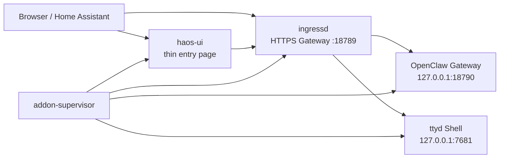

# OpenClaw HA Add-on Documentation

## English

### Project goal

`OpenClaw HA Add-on` keeps a clear boundary:

- upstream OpenClaw remains the real runtime
- the add-on provides Home Assistant friendly startup, ingress routing, HTTPS exposure, and a thin entry page
- the Home Assistant page is an operational shell, not a second full control panel

### Runtime architecture

### Why the project prefers HTTPS

Official OpenClaw Control UI expects a secure context for remote browser access.
In practice this means:

- `https://<host>:18789` is the recommended path
- `localhost` is also supported
- plain `http://<lan-ip>` is not a reliable long-term Control UI path

### Main page responsibilities

The main page intentionally stays focused.

- Open the native Gateway
- Open the maintenance Shell
- Show the current model and lightweight status
- Show or copy the Gateway token
- Run device approval helper actions

It does not try to replace the upstream Gateway UI.

### Supported add-on configuration

The add-on configuration page only exposes fields that this project currently consumes.

- `timezone`
- `disable_bonjour`
- `enable_terminal`
- `terminal_port`
- `gateway_mode`
- `gateway_remote_url`
- `gateway_bind_mode`
- `gateway_port`
- `gateway_public_url`
- `gateway_auth_mode`
- `homeassistant_token`
- `http_proxy`
- `gateway_trusted_proxies`
- `gateway_additional_allowed_origins`
- `enable_openai_api`
- `auto_configure_mcp`
- `run_doctor_on_start`

### Official runtime mapping

Where possible, the supervisor writes add-on values into the official runtime shape, including:

- `agents.defaults.userTimezone`
- `gateway.mode`
- `gateway.bind`
- `gateway.auth.mode`
- `gateway.remote.url`
- `gateway.trustedProxies`
- `gateway.controlUi.allowedOrigins`
- `gateway.http.endpoints.chatCompletions.enabled`
- `env.vars`

## 中文说明

### 项目目标

`OpenClaw HA Add-on` 的边界很明确：

- 上游 OpenClaw 仍然是真正的 runtime
- add-on 只负责 Home Assistant 友好的启动、Ingress 路由、HTTPS 暴露和一个很薄的入口页
- Home Assistant 里的页面是操作入口，不是第二套完整控制台

### 运行结构

当前实际结构如下：

- `addon-supervisor`
  - 负责准备目录、写入运行时配置、拉起子进程
- `ingressd`
  - 负责 HTTPS Gateway 暴露、HA Ingress 路由，以及 Shell 反向代理
- `haos-ui`
  - 负责 Home Assistant 里的薄入口页
- `OpenClaw Gateway`
  - 真正的上游 Web 控制台
- `ttyd`
  - 维护 Shell

### 为什么优先使用 HTTPS

官方 Control UI 对远程浏览器要求安全上下文。
实际使用里，这意味着：

- 推荐入口是 `https://<host>:18789`
- `localhost` 也可以
- `http://局域网IP` 不是长期可靠的 Control UI 打开方式

### 主页面职责

主页面只保留最需要的入口和状态：

- 打开原生 Gateway
- 打开维护 Shell
- 显示当前模型和轻量状态
- 显示或复制 Gateway Token
- 执行设备授权辅助动作

它不会尝试替代官方 Gateway 页面本身。

### 当前支持的配置项

Home Assistant 配置页当前暴露的是这批已经接通的字段：

- `timezone`
- `disable_bonjour`
- `enable_terminal`
- `terminal_port`
- `gateway_mode`
- `gateway_remote_url`
- `gateway_bind_mode`
- `gateway_port`
- `gateway_public_url`
- `gateway_auth_mode`
- `homeassistant_token`
- `http_proxy`
- `gateway_trusted_proxies`
- `gateway_additional_allowed_origins`
- `enable_openai_api`
- `auto_configure_mcp`
- `run_doctor_on_start`

### 与官方运行时的映射

只要有合理映射，supervisor 会把 add-on 配置写入官方配置结构，例如：

- `agents.defaults.userTimezone`
- `gateway.mode`
- `gateway.bind`
- `gateway.auth.mode`
- `gateway.remote.url`
- `gateway.trustedProxies`
- `gateway.controlUi.allowedOrigins`
- `gateway.http.endpoints.chatCompletions.enabled`
- `env.vars`

## Related documents / 相关文档

- [README](./README.md)
- [INSTALL](./INSTALL.md)
- [Maintainer Context](./docs/MAINTAINER_CONTEXT.md)
