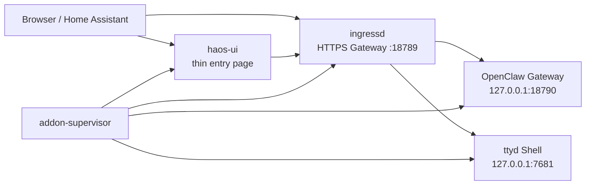

# OpenClaw HA Add-on Documentation

## Overview

`OpenClaw HA Add-on` keeps a clear boundary:

- upstream OpenClaw remains the real runtime
- the add-on provides Home Assistant friendly startup, ingress routing, HTTPS exposure, and a thin entry page
- the Home Assistant page is an entry shell, not a second full control panel

`OpenClaw HA Add-on` 的目标很明确：尽量不改写上游 OpenClaw，而是在 Home Assistant 里提供一层稳定、好维护、边界清晰的包装。

## Runtime architecture

## Why the project prefers HTTPS

Official OpenClaw Control UI expects a secure context for remote browser access.
In practice that means:

- `https://<host>:18789` is the recommended path
- `localhost` is also allowed
- plain `http://<lan-ip>` is not a reliable long-term Control UI path

因此，这个 add-on 的正式 Web 入口始终优先使用原生 HTTPS Gateway。

## Main page responsibilities

The main page intentionally stays focused.

- Open the native Gateway
- Open the maintenance Shell
- Show the current model and lightweight status
- Show or copy the Gateway token
- Run device approval helper actions

It does **not** try to replace the upstream Gateway UI.

## Routes and entrypoints

### Web UI

- Main add-on page:
  - Home Assistant sidebar ingress
- Native Gateway:
  - `https://<host>:18789/#token=...`

### Shell

- Maintenance Shell:
  - `./shell/`
  - backed by `ttyd`

### Gateway helper

- Main page button:
  - `./open-gateway`
  - redirects to the final native HTTPS Gateway URL and appends `#token=...` when a token is available

## Supported add-on configuration

The configuration page only exposes fields that this project really uses.

- `timezone`
- `disable_bonjour`
- `enable_terminal`
- `terminal_port`
- `gateway_mode`
- `gateway_remote_url`
- `gateway_bind_mode`
- `gateway_port`
- `gateway_public_url`
- `gateway_auth_mode`
- `homeassistant_token`
- `http_proxy`
- `gateway_trusted_proxies`
- `gateway_additional_allowed_origins`
- `enable_openai_api`
- `auto_configure_mcp`
- `run_doctor_on_start`

### Official runtime mapping

Where possible, the supervisor writes add-on values into the official runtime shape, for example:

- `agents.defaults.userTimezone`
- `gateway.mode`
- `gateway.bind`
- `gateway.auth.mode`
- `gateway.remote.url`
- `gateway.trustedProxies`
- `gateway.controlUi.allowedOrigins`
- `gateway.http.endpoints.chatCompletions.enabled`
- `env.vars`

## Device approval

The main page keeps a small approval helper because it is practical for HAOS use.

- `列出待批准设备`
  - runs `openclaw devices list --json`
- `确认最新授权`
  - runs `openclaw devices approve --latest`

This stays close to official CLI behavior and avoids the older “inject commands into a terminal UI” pattern.

## Project identity

- Name:
  - `OpenClaw HA Add-on`
- Repository:
  - `https://github.com/sunboss/openclaw-ha-addon`
- Image:
  - `ghcr.io/sunboss/openclaw-ha-addon`
- Slug:
  - `openclaw_ha_addon`

## Related docs

- [README](./README.md)
- [INSTALL](./INSTALL.md)
- [Maintainer context](./docs/MAINTAINER_CONTEXT.md)
