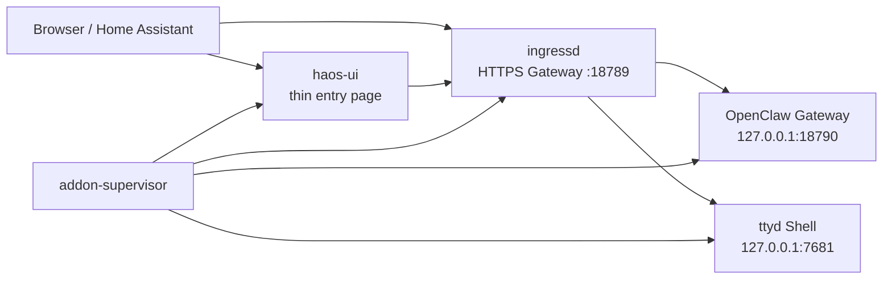

# OpenClaw HA Add-on Documentation

## English

### Project boundary

This project intentionally keeps a clear boundary:

- upstream OpenClaw remains the real runtime
- the add-on provides Home Assistant startup, ingress routing, HTTPS exposure, and a thin entry page
- the Home Assistant page is an operational shell, not a second full control panel

### Runtime architecture

### Why HTTPS is the preferred path

Official OpenClaw Control UI expects a secure browser context for remote access.
In practice that means:

- `https://<host>:18789` is the recommended path
- `localhost` also works
- plain `http://<lan-ip>` is not a reliable long-term Control UI path

### What the Home Assistant page should do

The Home Assistant page stays focused on operations only:

- open the native Gateway
- open the maintenance Shell
- show current model and status
- show the current token
- help with browser device approval

It does not try to replace the upstream Gateway UI.

### Configuration mapping

Where possible, the supervisor maps add-on fields into the official OpenClaw shape:

- `agents.defaults.userTimezone`
- `gateway.mode`
- `gateway.bind`
- `gateway.auth.mode`
- `gateway.remote.url`
- `gateway.trustedProxies`
- `gateway.controlUi.allowedOrigins`
- `gateway.http.endpoints.chatCompletions.enabled`
- `env.vars`

## 中文说明

### 项目边界

这个项目刻意保持边界清晰：

- 上游 OpenClaw 仍然是实际运行时
- add-on 只负责 Home Assistant 启动、Ingress 路由、HTTPS 暴露和一个轻量入口页
- Home Assistant 页面是操作入口，不是第二套完整控制台

### 运行架构

当前结构可以理解为：

- `addon-supervisor`
  - 负责准备目录、写入运行时配置、拉起子进程
- `ingressd`
  - 负责 HTTPS Gateway 暴露、HA Ingress 路由和 Shell 反向代理
- `haos-ui`
  - 负责 Home Assistant 里的薄入口页
- `OpenClaw Gateway`
  - 真实的上游 Web 控制台
- `ttyd`
  - 维护 Shell

### 为什么优先使用 HTTPS

官方 Control UI 对远程浏览器要求安全上下文。实际使用时：

- 推荐入口是 `https://<host>:18789`
- `localhost` 也可用
- `http://局域网 IP` 不适合作为长期稳定的 Control UI 打开方式

### Home Assistant 页面职责

Home Assistant 页面只负责几个必要动作：

- 打开原生 Gateway
- 打开维护 Shell
- 显示当前模型和轻量状态
- 显示当前 Token
- 辅助浏览器设备授权

它不尝试替代官方 Gateway 页面本身。

### 配置映射

只要字段有合理映射，supervisor 会把 add-on 配置写进官方 OpenClaw 结构，例如：

- `agents.defaults.userTimezone`
- `gateway.mode`
- `gateway.bind`
- `gateway.auth.mode`
- `gateway.remote.url`
- `gateway.trustedProxies`
- `gateway.controlUi.allowedOrigins`
- `gateway.http.endpoints.chatCompletions.enabled`
- `env.vars`

## Related documents / 相关文档

- [README](./README.md)
- [INSTALL](./INSTALL.md)
- [Maintainer Context](./docs/MAINTAINER_CONTEXT.md)
